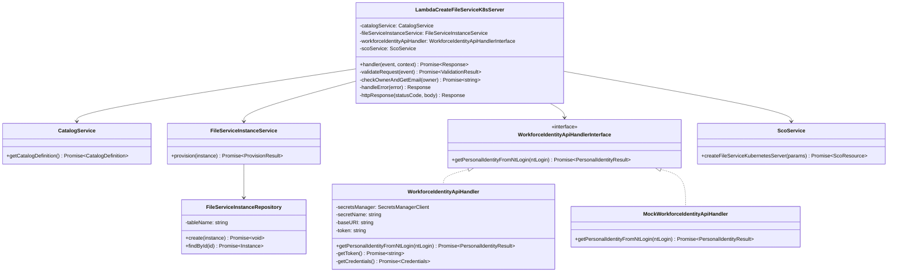

# Lambda Create File Service K8s Server

## Table of Contents
- [Overview](#overview)
- [Architecture](#architecture)
- [Workflow](#workflow)
- [Input Specification](#input-specification)
- [Output Specification](#output-specification)
- [Dependencies](#dependencies)
- [Environment Variables](#environment-variables)
- [Error Handling](#error-handling)
- [Usage Examples](#usage-examples)
- [Testing](#testing)

---

## Overview

This AWS Lambda function orchestrates the provisioning of File Service instances for Kubernetes projects. It serves as the integration point between:
- **API Gateway** (request entry)
- **Service Catalog** (service/plan validation)
- **Workforce Identity API** (owner verification)
- **DynamoDB** (instance persistence)
- **SCO (Service Catalog Orchestrator)** (FinOps resource tracking)

### Purpose
Provision and register File Service Kubernetes servers while ensuring:
1. Valid service catalog offerings
2. Authorized resource owners
3. Persistent instance tracking
4. FinOps compliance through SCO registration

---

## Architecture

### System Context Diagram


### Component Architecture



---

## Workflow

### Execution Flow Diagram


### Detailed Processing Steps

1. **Request Reception & Parsing**
   - Receive APIGatewayEvent from API Gateway
   - Parse JSON body to extract `LambdaCreateFileServiceK8sServerEvent`
   - Log event for debugging

2. **Request Validation**
   - Validate presence of required fields:
     - `serviceId` - The service identifier from catalog
     - `planId` - The plan identifier for the service
     - `owner` - NT login of the resource owner
     - `instanceName` - Unique name for the file service
     - `parentReference` - Parent K8s project ID
     - `performanceClass` - Performance tier for the file service
   - Return 400 Bad Request if validation fails

3. **Owner Verification**
   - Query Workforce Identity API with owner's NT login
   - Authenticate using credentials from AWS Secrets Manager
   - Retrieve owner's email (`mailInternal` field)
   - Return 400 if owner not found or API fails

4. **Catalog Validation**
   - Fetch catalog definition from CatalogService
   - Verify `serviceId` exists in catalog
   - Verify `planId` exists for the specified service
   - Return 404 if service or plan not found

5. **Instance Provisioning**
   - Generate unique instance ID: `fs-k8s-{timestamp}`
   - Create file service instance object with:
     - `id` - Generated instance identifier
     - `name` - Instance name from request
     - `projectId` - Parent K8s project reference
     - `description` - Optional description
     - `createdBy` - Owner's email
   - Persist to DynamoDB via FileServiceInstanceService
   - Return 409 Conflict if instance already exists

6. **SCO Resource Registration**
   - Prepare SCO parameters with:
     - `instanceName` - File service instance name
     - `parentReference` - K8s project ID (for FinOps tracking)
     - `location` - Optional deployment location
     - `performanceClass` - Performance tier
     - `protection` - Optional protection level
   - Register resource in SCO system
   - Link to parent K8s project for cost allocation

7. **Response Generation**
   - Generate unique request ID: `req-{timestamp}`
   - Return 201 Created with:
     - `requestId` - Unique request identifier
     - `instanceId` - File service instance ID
     - `scoInstanceId` - SCO resource ID
     - `state` - Current instance state

---

## Input Specification

### Event Structure

The Lambda accepts an AWS APIGatewayEvent with the following body structure:

```typescript
interface LambdaCreateFileServiceK8sServerEvent {
  serviceId: string;              // REQUIRED: Service catalog ID
  planId: string;                 // REQUIRED: Plan ID within the service
  name: string;                   // Name/title of the resource (not used, kept for compatibility)
  description?: string;           // Optional description of the instance
  owner: string;                  // REQUIRED: NT login of the owner
  technicalContactEmail: string;  // REQUIRED: Technical contact email
  instanceName: string;           // REQUIRED: Unique name for the file service
  parentReference: string;        // REQUIRED: K8s project ID (parent resource)
  location?: string;              // Optional: Deployment location/region
  performanceClass: string;       // REQUIRED: Performance tier (e.g., "standard", "premium")
  protection?: string;            // Optional: Protection/backup level
}
```

### Field Descriptions

| Field | Type | Required | Description | Example |
|-------|------|----------|-------------|---------|
| `serviceId` | string | ✅ Yes | Service identifier from the service catalog | `"file-service-k8s"` |
| `planId` | string | ✅ Yes | Plan identifier for the chosen service tier | `"basic-plan"` |
| `name` | string | ❌ No | Display name (legacy field, not actively used) | `"My File Service"` |
| `description` | string | ❌ No | Human-readable description of the instance | `"Shared storage for dev team"` |
| `owner` | string | ✅ Yes | NT login of the resource owner (must exist in Workforce Identity) | `"jdoe"` |
| `technicalContactEmail` | string | ✅ Yes | Email for technical notifications | `"jdoe@swisscom.com"` |
| `instanceName` | string | ✅ Yes | Unique identifier name for the file service | `"dev-team-storage"` |
| `parentReference` | string | ✅ Yes | Kubernetes project ID (parent resource for FinOps) | `"k8s-proj-12345"` |
| `location` | string | ❌ No | Geographic location or AWS region | `"eu-central-1"` |
| `performanceClass` | string | ✅ Yes | Performance tier defining I/O and capacity | `"standard"`, `"high-performance"` |
| `protection` | string | ❌ No | Backup/protection level | `"basic"`, `"enhanced"` |

### Example Request

```json
{
  "body": "{\"serviceId\":\"file-service-k8s\",\"planId\":\"basic-plan\",\"name\":\"Dev Team Storage\",\"description\":\"Shared file storage for development team\",\"owner\":\"jdoe\",\"technicalContactEmail\":\"jdoe@swisscom.com\",\"instanceName\":\"dev-team-fs-001\",\"parentReference\":\"k8s-proj-98765\",\"location\":\"eu-central-1\",\"performanceClass\":\"standard\",\"protection\":\"basic\"}"
}
```

---

## Output Specification

### Success Response (HTTP 201)

```json
{
  "statusCode": 201,
  "headers": {
    "Content-Type": "application/json",
    "Access-Control-Allow-Origin": "*"
  },
  "body": {
    "requestId": "req-1706968800000",
    "instanceId": "fs-k8s-1706968800000",
    "scoInstanceId": "sco-resource-uuid-12345",
    "state": "PROVISIONING"
  }
}
```

#### Response Fields

| Field | Type | Description |
|-------|------|-------------|
| `requestId` | string | Unique identifier for this provisioning request |
| `instanceId` | string | DynamoDB instance ID for the file service |
| `scoInstanceId` | string | SCO resource ID for FinOps tracking |
| `state` | string | Current provisioning state (e.g., "PROVISIONING", "ACTIVE") |

### Error Responses

#### 400 Bad Request - Missing Required Fields
```json
{
  "statusCode": 400,
  "headers": {
    "Content-Type": "application/json",
    "Access-Control-Allow-Origin": "*"
  },
  "body": {
    "error": "serviceId is required"
  }
}
```

Possible validation errors:
- `"serviceId is required"`
- `"planId is required"`
- `"owner is required"`
- `"instanceName is required"`
- `"parentReference (project ID) is required"`
- `"performanceClass is required"`

#### 400 Bad Request - Owner Validation Failed
```json
{
  "statusCode": 400,
  "headers": {
    "Content-Type": "application/json",
    "Access-Control-Allow-Origin": "*"
  },
  "body": {
    "error": "Failed to validate owner: Owner jdoe not found in Workforce Identity API"
  }
}
```

#### 404 Not Found - Service Not Found
```json
{
  "statusCode": 404,
  "headers": {
    "Content-Type": "application/json",
    "Access-Control-Allow-Origin": "*"
  },
  "body": {
    "error": "Service file-service-k8s not found in catalog"
  }
}
```

#### 404 Not Found - Plan Not Found
```json
{
  "statusCode": 404,
  "headers": {
    "Content-Type": "application/json",
    "Access-Control-Allow-Origin": "*"
  },
  "body": {
    "error": "Plan premium-plan not found for service file-service-k8s"
  }
}
```

#### 409 Conflict - Instance Already Exists
```json
{
  "statusCode": 409,
  "headers": {
    "Content-Type": "application/json",
    "Access-Control-Allow-Origin": "*"
  },
  "body": {
    "error": "File service instance already exists",
    "instance": {
      "id": "fs-k8s-1706968800000",
      "name": "dev-team-fs-001",
      "projectId": "k8s-proj-98765"
    }
  }
}
```

#### 500 Internal Server Error
```json
{
  "statusCode": 500,
  "headers": {
    "Content-Type": "application/json",
    "Access-Control-Allow-Origin": "*"
  },
  "body": {
    "error": "Internal server error",
    "message": "Failed to connect to SCO service"
  }
}
```

---

## Dependencies

### AWS Services
- **AWS Lambda** - Serverless compute runtime
- **API Gateway** - HTTP API endpoint
- **DynamoDB** - File service instance persistence
- **Secrets Manager** - Secure credential storage
  - Workforce Identity API credentials
  - SCO API credentials

### Lambda Layers
All lambda layers are file-based dependencies resolved at build time:

#### 1. **lambda-layer-catalog** (`lambda-layer-catalog/src/catalog-service`)
- **Purpose**: Service catalog management
- **Exports**: `CatalogService`
- **Functionality**: 
  - Fetch catalog definitions
  - Validate service and plan IDs
  - Retrieve service metadata

#### 2. **lambda-layer-file-service-instance** (`lambda-layer-file-service-instance/src/file-service-instance-service`)
- **Purpose**: File service instance lifecycle management
- **Exports**: 
  - `FileServiceInstanceService` - Business logic layer
  - `FileServiceInstanceRepository` - DynamoDB data access layer
- **Functionality**:
  - Create file service instances
  - Check instance existence
  - Manage instance state

#### 3. **lambda-layer-sco** (`lambda-layer-sco/src/sco-service`)
- **Purpose**: SCO (Service Catalog Orchestrator) integration
- **Exports**: 
  - `ScoService` - SCO API client
  - `ScoServiceFactory` - Factory for creating SCO service instances
- **Functionality**:
  - Register file service K8s servers in SCO
  - Track resources for FinOps
  - Link resources to parent projects

### NPM Dependencies

```json
{
  "dependencies": {
    "@aws-sdk/client-secrets-manager": "3.846.0"
  },
  "devDependencies": {
    "@types/aws-lambda": "^8.10.149",
    "lambda-layer-catalog": "file:../../lambda-layers/lambda-layer-catalog",
    "lambda-layer-sco": "file:../../lambda-layers/lambda-layer-sco",
    "lambda-layer-file-service-instance": "file:../../lambda-layers/lambda-layer-file-service-instance"
  }
}
```

### Runtime Dependencies (AWS Lambda Powertools)
These are provided by the Lambda runtime environment:
- `@aws-lambda-powertools/logger` - Structured logging with correlation IDs
- `@aws-lambda-powertools/tracer` - X-Ray distributed tracing

### External APIs

#### Workforce Identity API
- **Purpose**: Validate resource owners and retrieve email addresses
- **Authentication**: Bearer token obtained via username/password
- **Endpoints**:
  - `POST /layer/workforce-identity-store/standard/openidm/endpoint/digitalMarketplace/auth` - Authentication
  - `GET /layer/workforce-identity-store/standard/openidm/endpoint/digitalMarketplace/PersonalIdentity` - User lookup
- **Configuration**:
  - Base URI from `WORKFORCE_IDENTITY_API_BASE_URI`
  - Credentials from AWS Secrets Manager (`WORKFORCE_IDENTITY_API_CREDENTIALS_SECRET_NAME`)

#### SCO (Service Catalog Orchestrator) API
- **Purpose**: Register and track cloud resources for FinOps
- **Integration**: Via `ScoService` from lambda-layer-sco
- **Functionality**:
  - Create file service K8s server resources
  - Associate resources with K8s projects (parent references)
  - Enable cost tracking and allocation

---

## Environment Variables

### Required Environment Variables

| Variable | Type | Description | Example |
|----------|------|-------------|---------|
| `AWS_REGION` | string | AWS region for SDK clients | `"eu-central-1"` |
| `FILE_SERVICE_INSTANCE_TABLE` | string | DynamoDB table name for file service instances | `"ikube2-file-service-instance"` |
| `WORKFORCE_IDENTITY_API_CREDENTIALS_SECRET_NAME` | string | AWS Secrets Manager secret name for Workforce Identity API | `"workforce-identity-api-creds"` |
| `WORKFORCE_IDENTITY_API_BASE_URI` | string | Base URL for Workforce Identity API | `"https://api.swisscom.com"` |
| `WORKFORCE_MOCK_ENABLED` | string | Enable/disable mock Workforce API (`"true"`/`"false"`) | `"false"` |

### Optional Environment Variables

| Variable | Type | Description | Default |
|----------|------|-------------|---------|
| `LOG_LEVEL` | string | Powertools Logger level | `"INFO"` |
| `POWERTOOLS_SERVICE_NAME` | string | Service name for logs/traces | `"lambda-create-file-service-k8s-server"` |

### Secrets Manager Structure

#### Workforce Identity API Credentials Secret
```json
{
  "username": "api-user",
  "password": "secure-password"
}
```

---

## Error Handling

### Error Categories


### Error Handling Strategy

1. **Input Validation Errors (400)**
   - Missing required fields
   - Invalid field formats
   - Logged at ERROR level with full context

2. **Not Found Errors (404)**
   - Service ID not in catalog
   - Plan ID not found for service
   - Logged at WARN level

3. **Conflict Errors (409)**
   - Instance already exists in database
   - Returns existing instance details
   - Logged at WARN level

4. **Owner Validation Errors (400)**
   - Owner not found in Workforce Identity API
   - Workforce Identity API authentication failure
   - Logged at ERROR level with API response details

5. **Server Errors (500)**
   - Unexpected exceptions
   - External service failures (SCO, DynamoDB)
   - Logged at ERROR level with full stack trace

### Logging Strategy

All errors are logged using AWS Lambda Powertools Logger with:
- **Correlation IDs** - Automatically injected from Lambda context
- **Structured logging** - JSON format for CloudWatch Insights queries
- **Error context** - Full request details and error messages
- **Distributed tracing** - X-Ray integration for request flow visualization

---

## Usage Examples

### Example 1: Basic File Service Provisioning

**Request:**
```bash
curl -X POST https://api.example.com/file-service-k8s-server \
  -H "Content-Type: application/json" \
  -d '{
    "serviceId": "file-service-k8s",
    "planId": "standard",
    "owner": "jsmith",
    "technicalContactEmail": "jsmith@swisscom.com",
    "instanceName": "team-a-storage",
    "parentReference": "k8s-proj-001",
    "performanceClass": "standard"
  }'
```

**Response:**
```json
{
  "requestId": "req-1706968800000",
  "instanceId": "fs-k8s-1706968800000",
  "scoInstanceId": "a1b2c3d4-e5f6-7890-abcd-ef1234567890",
  "state": "PROVISIONING"
}
```

### Example 2: High-Performance File Service with Optional Parameters

**Request:**
```bash
curl -X POST https://api.example.com/file-service-k8s-server \
  -H "Content-Type: application/json" \
  -d '{
    "serviceId": "file-service-k8s",
    "planId": "premium",
    "name": "Production Data Lake",
    "description": "High-performance storage for analytics workloads",
    "owner": "mjones",
    "technicalContactEmail": "mjones@swisscom.com",
    "instanceName": "prod-analytics-fs",
    "parentReference": "k8s-proj-prod-123",
    "location": "eu-central-1",
    "performanceClass": "high-performance",
    "protection": "enhanced"
  }'
```

**Response:**
```json
{
  "requestId": "req-1706968900000",
  "instanceId": "fs-k8s-1706968900000",
  "scoInstanceId": "b2c3d4e5-f6g7-8901-bcde-fg2345678901",
  "state": "PROVISIONING"
}
```

### Example 3: Error - Missing Required Field

**Request:**
```bash
curl -X POST https://api.example.com/file-service-k8s-server \
  -H "Content-Type: application/json" \
  -d '{
    "serviceId": "file-service-k8s",
    "planId": "standard",
    "owner": "jdoe"
  }'
```

**Response:**
```json
{
  "error": "instanceName is required"
}
```

### Example 4: Error - Owner Not Found

**Request:**
```bash
curl -X POST https://api.example.com/file-service-k8s-server \
  -H "Content-Type: application/json" \
  -d '{
    "serviceId": "file-service-k8s",
    "planId": "standard",
    "owner": "invaliduser",
    "technicalContactEmail": "test@swisscom.com",
    "instanceName": "test-storage",
    "parentReference": "k8s-proj-999",
    "performanceClass": "standard"
  }'
```

**Response:**
```json
{
  "error": "Failed to validate owner: Owner invaliduser not found in Workforce Identity API"
}
```

---

## Testing

### Test Configuration

The module has tests disabled by default:

```json
{
  "scripts": {
    "test": "echo 'Tests disabled for lambda-create-file-service-k8s-server' && exit 0"
  }
}
```

### Manual Testing Approach

For manual testing, use the following strategies:

1. **Unit Testing** (When Implemented)
   - Mock all external dependencies (Catalog, Workforce API, SCO, DynamoDB)
   - Test validation logic independently
   - Verify error handling paths

2. **Integration Testing**
   - Use mock mode for Workforce Identity API (`WORKFORCE_MOCK_ENABLED=true`)
   - Test against development DynamoDB tables
   - Verify end-to-end flow with real AWS services

3. **Local Testing with SAM**
   ```bash
   sam local invoke LambdaCreateFileServiceK8sServer \
     -e test-events/create-file-service.json \
     --env-vars test-env.json
   ```

### Test Data

Example test event (`test-events/create-file-service.json`):
```json
{
  "body": "{\"serviceId\":\"file-service-k8s\",\"planId\":\"standard\",\"owner\":\"testuser\",\"technicalContactEmail\":\"test@swisscom.com\",\"instanceName\":\"test-fs-001\",\"parentReference\":\"k8s-proj-test\",\"performanceClass\":\"standard\"}"
}
```

Example environment variables (`test-env.json`):
```json
{
  "LambdaCreateFileServiceK8sServer": {
    "AWS_REGION": "eu-central-1",
    "FILE_SERVICE_INSTANCE_TABLE": "test-file-service-instance",
    "WORKFORCE_IDENTITY_API_CREDENTIALS_SECRET_NAME": "test-workforce-creds",
    "WORKFORCE_IDENTITY_API_BASE_URI": "https://api-test.swisscom.com",
    "WORKFORCE_MOCK_ENABLED": "true"
  }
}
```

---

## Development

### Build

```bash
pnpm build
```

Compiles TypeScript to JavaScript in the `dist/` directory.

### Clean

```bash
pnpm clean
```

Removes `dist/`, `node_modules/`, and `results/` directories.

### Project Structure

```
lambda-create-file-service-k8s-server/
├── src/
│   ├── index.ts                                    # Main Lambda handler
│   ├── workforce-identity-api-handler.ts           # Real Workforce API client
│   ├── workforce-identity-api-handler-mock.ts      # Mock Workforce API client
│   ├── workforce-identity-api-handler-interface.ts # Workforce API interface
│   ├── workforce-identity-api-handler-factory.ts   # Factory for API handler creation
│   └── model/
│       └── personal-identity-result.ts             # Workforce API response model
├── test/
│   └── index.test.ts                               # Test suite (disabled)
├── package.json                                    # NPM dependencies
├── tsconfig.json                                   # TypeScript configuration
├── jest.config.js                                  # Jest test configuration
└── README.md                                       # This file
```

---

## Troubleshooting

### Common Issues

1. **Owner Validation Fails**
   - **Symptom**: 400 error - "Failed to validate owner"
   - **Cause**: Owner NT login not found in Workforce Identity API
   - **Solution**: Verify the owner exists and `WORKFORCE_MOCK_ENABLED` is set correctly

2. **Service/Plan Not Found**
   - **Symptom**: 404 error - "Service/Plan not found"
   - **Cause**: Invalid `serviceId` or `planId`
   - **Solution**: Check catalog definition and ensure IDs match exactly

3. **Instance Already Exists**
   - **Symptom**: 409 error - "File service instance already exists"
   - **Cause**: Duplicate provisioning attempt
   - **Solution**: Use returned instance details or provision with different `instanceName`

4. **SCO Registration Fails**
   - **Symptom**: 500 error with SCO-related message
   - **Cause**: SCO service unavailable or authentication failure
   - **Solution**: Check SCO service health and verify credentials in Secrets Manager

---

## License

© Swisscom AG - Internal Use Only

---

## Maintainers

**Team**: Cloud Platform Services (CPS)  
**Contact**: Platform Team

For questions or issues, please contact the platform team or open an issue in the repository.
