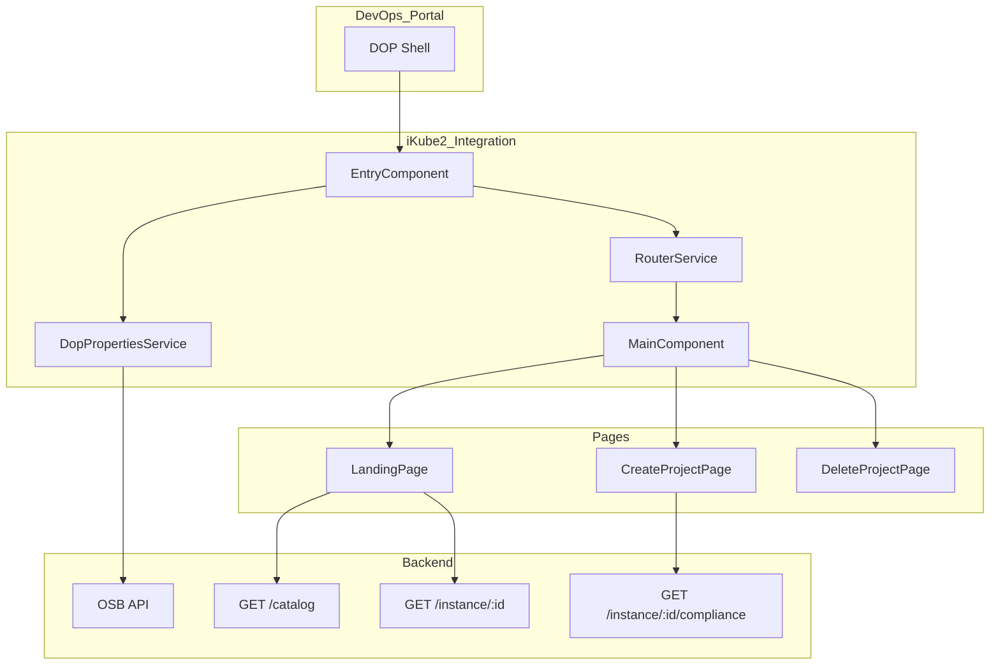

```mermaid
graph TB
    subgraph "DevOps Portal"
        DOP[DOP Shell]
    end
    
    subgraph "iKube2 Integration"
        Entry[EntryComponent<br/>dop-integration-ikube2]
        Router[RouterService<br/>@vaadin/router]
        Main[MainComponent]
        DopSvc[DopPropertiesService<br/>Singleton State]
    end
    
    subgraph "Pages"
        Landing[LandingPage<br/>/]
        Create[CreateProjectPage<br/>/create-project]
        Delete[DeleteProjectPage<br/>/delete-project/:id]
    end
    
    subgraph "Backend"
        OSB[OSB API<br/>Service Broker]
        Catalog[GET /catalog]
        Instance[GET /instance/:id]
        Compliance[GET /instance/:id/compliance]
    end
    
    DOP -->|Inject Handlers| Entry
    Entry -->|Initialize| DopSvc
    Entry -->|Attach| Router
    Router --> Main
    Main --> Landing
    Main --> Create
    Main --> Delete
    
    DopSvc -->|HTTP| OSB
    Landing -->|Fetch| Catalog
    Landing -->|List| Instance
    Create -->|Check| Compliance
    
    style Entry fill:#e1f5ff
    style DopSvc fill:#e8f5e9
    style OSB fill:#fff4e1
```



